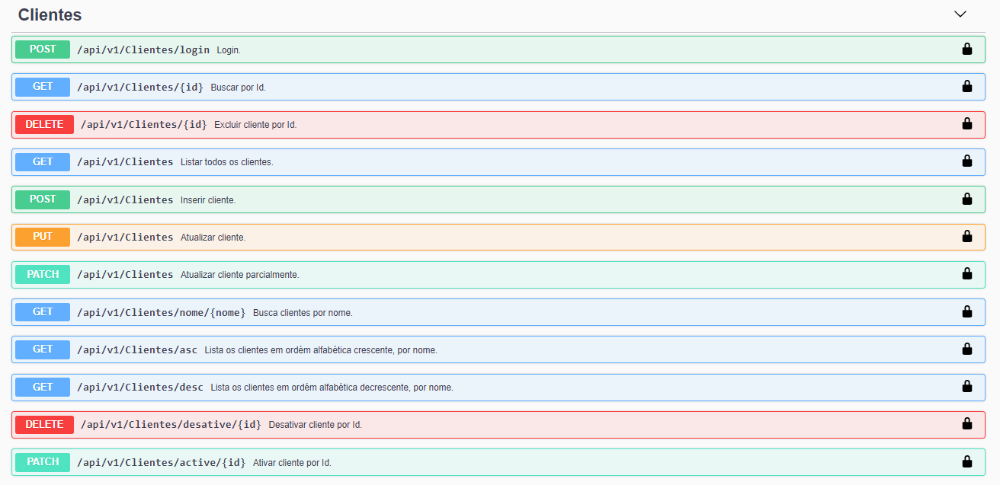
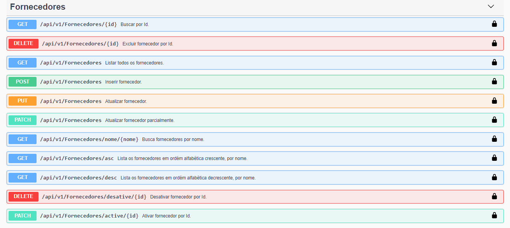
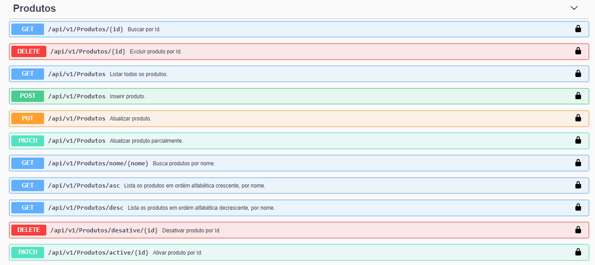
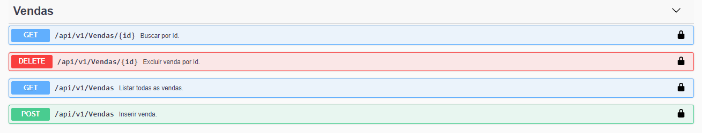

<p align="center">

</p>
<h1 align="center">PRODUTOS GFT</h1>
<h4 align="center">API para simular um ambiente de venda de produto. Desenvolvida no programa Start, da GFT Brasil</h4>

# 🤔 O que é o programa Start?

Criado pela GFT, o Programa START foi concebido com o objetivo de formar e desenvolver jovens profissionais segundo os valores e competências da GFT. Durante o estágio, os STARTERS, como nossos estagiários são chamados, irão passar por diferentes etapas, de forma a se tornar um profissional preparado a enfrentar os mais diversos desafios.

# 🚀 Executando o projeto

##### 📢  É preciso mudar o endereço do Banco de Dados, mexendo no arquivo **💾appsettings.json** localizado em **📁ProdutosGFT.Server/**
#####  Para executar o projeto, é necessário que o MySQL e o Dotnet Core 3.1 (ou superior) estejam instalados na maquina

```bash
# Entre na pasta do projeto:
$ cd ProdutosGFT/

# Digite o comando a seguir, para restaurar as dependências:
$ dotnet restore

# Logo após a instalação das dependências, digite o comando:
$ dotnet run --project ProdutosGFT.Server
# -> Ele criará o banco de dados MySQL automaticamente, no endereço do appsettings

# O servidor inciará na porta:5001 - acesse <http://localhost:5001/swagger>
```


## ⚙ Para acessar

Para ter acesso a API, você poderá usar dois logins diferentes:

- ✉ admin@gmail.com  🔑12345   🔒Administrador

- ✉ joao@gmail.com   🔑12345   🔒Usuário

# 📐 Arquitetura

A arquitetura do projeto se inspirou na orientação do modelo Clean Architecture, de Bob Martin, do qual visa separar um projeto em camadas
E com isso, o projeto possui as seguintes camadas:

#### 💰 Domain
Contem a regra de negócio (Entidades, Interfaces, etc..)

#### 📜 Data
Contem a integração com o banco de dados 

#### 🏭 Server
Contem a WebAPI (Controllers, Services, DTOs, etc..)

# 💡 Tecnologias

Esse projeto foi desenvolvido com as seguintes tecnologias:

- [DotNet Core 3.1](https://dotnet.microsoft.com/download/dotnet-core/3.1)
- [Entity Framework](https://www.entityframeworktutorial.net/what-is-entityframework.aspx)
- [JWT](https://jwt.io/)
- [Fluent Validation](https://fluentvalidation.net/)
- [Swagger](https://swagger.io/)
- [MySQL](https://www.mysql.com/)

# 🚥 Endpoints (Rotas)









<hr>


